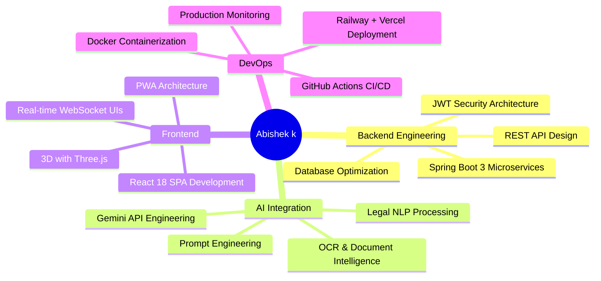

<div align="center">


<br/>

[](https://git.io/typing-svg)

<p align="center">
  <a href="https://linkedin.com/in/abishekvsb"></a>
  <a href="mailto:abishekvsb@gmail.com"></a>
  <a href="https://github.com/Abishekvsb"></a>
  
</p>

</div>

---

## 🧑‍💻 About Me

```yaml
name: Abishek k
title: Full-Stack Software Engineer
location: Tamil Nadu, India 🇮🇳
currently_building:
  - CitizenLex — AI-Powered Legal Research Platform
  - AI document intelligence with Gemini 2.5 Flash
  - Production-grade Java microservices
focus_areas:
  - Backend: Java 17, Spring Boot 3, REST APIs, Spring Security, JPA/Hibernate
  - Frontend: React 18, Vite, PWA, Three.js, GSAP animations
  - AI/ML: Google Gemini, OCR (Tesseract.js), NLP legal reasoning
  - DevOps: Docker, Railway, Vercel, GitHub Actions CI/CD
  - Database: MySQL 8, Spring Data JPA, HikariCP connection pooling
interests:
  - Legal Technology & Access to Justice
  - AI Engineering & Prompt Engineering
  - System Design & Architecture
  - Open Source Contributions
```

---

## 🏆 Featured Project

<div align="center">

[](https://github.com/Abishekvsb/Ai-powered-CitizenLex)

</div>

### ⚖️ CitizenLex — AI-Powered Legal Platform

> *Democratizing access to justice for 1.4 billion Indians*

| Layer | Technologies |
|---|---|
| **Backend** | Java 17, Spring Boot 3.2.5, Spring Security (JWT), WebSocket |
| **Frontend** | React 18, Vite 5, PWA, GSAP, Three.js, Bootstrap 5 |
| **AI** | Google Gemini 2.5 Flash, Apache PDFBox, Apache POI, Tesseract.js OCR |
| **Payments** | Razorpay SDK |
| **Storage** | MySQL 8 (Railway), Cloudinary CDN |
| **Maps** | Google Maps JS API + Geocoding |
| **Video** | Jitsi Meet (WebRTC) |
| **Deploy** | Vercel (frontend), Railway (backend + DB) |

**76 verified advocates** · **38 Tamil Nadu districts** · **5 rights domains** · **17 REST APIs** · **20 JPA entities**

---

## 🛠️ Tech Stack

### Backend & API


### Frontend


### AI & Machine Learning


### Database & Storage


### DevOps & Cloud


### Tools & APIs


---

## 📊 GitHub Statistics

<div align="center">


</div>

---

## 🏅 GitHub Trophies

<div align="center">

[](https://github.com/ryo-ma/github-profile-trophy)

</div>

---

## 📈 Contribution Graph

<div align="center">

[](https://github.com/ashutosh00710/github-readme-activity-graph)

</div>

---

## 🎯 Current Focus



---

## 📬 Let's Connect

<div align="center">

| Platform | Link |
|----------|------|
| 💼 **LinkedIn** | https://www.linkedin.com/in/abishek-k-9b0bb5382 |
| 📧 **Email** | abishek.k.officl@gmail.com |
| 🐙 **GitHub** | https://github.com/Abishekvsb |
| 🌐 **Portfolio** | https://ai-powered-citizen-lex.vercel.app |


*Open to full-time Software Engineer roles, internships, and exciting open-source collaborations.*

</div>

---

<div align="center">


<sub>💡 "The intersection of technology and justice is where I build."</sub>

</div>
