<div align="center">


<br/>

[](https://git.io/typing-svg)

<p align="center">
  <a href="https://linkedin.com/in/abishekvsb"></a>
  <a href="mailto:abishekvsb@gmail.com"></a>
  <a href="https://github.com/Abishekvsb"></a>
  
</p>

<p align="center">
  <a href="https://github.com/Abishekvsb/Ai-powered-CitizenLex/actions/workflows/java-ci.yml">
    
  </a>
  <a href="https://opensource.org/licenses/MIT">
    
  </a>
  
  
</p>

<p align="center">
  <a href="https://go.screenpal.com/watch/cOilXXnUxQb" target="_blank">
    
  </a>
</p>

</div>

---

## 🧑‍💻 About Me

```yaml
name: Abishek k
title: Full-Stack Software Engineer
location: Tamil Nadu, India 🇮🇳
currently_building:
  - CitizenLex — AI-Powered Legal Research Platform
  - AI document intelligence with Gemini 2.5 Flash
  - Production-grade Java microservices
focus_areas:
  - Backend: Java 17, Spring Boot 3, REST APIs, Spring Security, JPA/Hibernate
  - Frontend: React 18, Vite, PWA, Three.js, GSAP animations
  - AI/ML: Google Gemini, OCR (Tesseract.js), NLP legal reasoning
  - DevOps: Docker, Railway, Vercel, GitHub Actions CI/CD
  - Database: MySQL 8, Spring Data JPA, HikariCP connection pooling
interests:
  - Legal Technology & Access to Justice
  - AI Engineering & Prompt Engineering
  - System Design & Architecture
  - Open Source Contributions
```

---

## 🚀 Live Demo

| | |
|---|---|
| 🌐 **Production Website** | https://ai-powered-citizen-lex.vercel.app |
| 🎬 **Project Demo Video** | https://go.screenpal.com/watch/cOilXXnUxQb |
| ⚙️ **Backend API** | https://ai-powered-citizenlex-production.up.railway.app |
| 📦 **GitHub Repository** | https://github.com/Abishekvsb/Ai-powered-CitizenLex |

---

## ✨ Key Features

| Feature | Description |
|---|---|
| 🔐 **JWT Authentication** | Secure login, registration, and token-based session management |
| 🤖 **AI Legal Assistant** | Conversational legal guidance powered by Google Gemini AI |
| ⚖️ **AI Legal Copilot** | Step-by-step legal reasoning and case analysis with Gemini 2.5 Flash |
| 📚 **Rights Explorer** | Browse fundamental rights organized by domain and category |
| 🏛️ **Government Scheme Finder** | Discover and filter government welfare schemes by eligibility |
| 📝 **AI Legal Draft Generator** | Auto-generate FIRs, RTIs, complaints, contracts, and affidavits |
| 👨‍⚖️ **Lawyer Marketplace** | Find and book verified advocates across 38 Tamil Nadu districts |
| 🔍 **OCR Document Scanner** | Upload and extract text from legal documents using Tesseract.js |
| 📊 **Dashboard & Analytics** | Personalized user dashboard with activity and case summaries |
| 🔔 **Notifications** | Real-time in-app notification system with unread badge counts |
| 📱 **Responsive UI** | Mobile-first design that adapts seamlessly across all screen sizes |
| 📲 **Progressive Web App (PWA)** | Installable on desktop and Android; supports offline access |

---

## 🛠 Technology Stack

| Layer | Technologies |
|---|---|
| **Frontend** | React 18, Vite 5, Bootstrap 5, GSAP, Three.js, Axios |
| **Backend** | Java 17, Spring Boot 3.2.5, Spring Security, Spring Data JPA, Hibernate |
| **Authentication** | JWT (JSON Web Tokens), BCrypt password encoding |
| **Database** | MySQL 8 (Railway Cloud) |
| **AI & ML** | Google Gemini 2.5 Flash, Tesseract.js OCR, Apache PDFBox, Apache POI |
| **Storage** | Cloudinary CDN (profile photos and media) |
| **Maps** | Google Maps JavaScript API + Geocoding API |
| **Payments** | Razorpay SDK |
| **Video** | Jitsi Meet (WebRTC) |
| **Deployment** | Vercel (Frontend) + Railway (Backend + Database) |
| **CI/CD** | GitHub Actions (Java CI/CD + CodeQL Security Analysis) |
| **Version Control** | Git & GitHub |

---

## 🏗 System Architecture

```
Internet → Vercel Edge → React SPA → Railway API → Railway MySQL
                                    ↘ Gemini AI, Cloudinary, Google Maps
```

> 📐 *System Architecture Diagram — to be inserted later*

---

## 🗄 Database Design

- **Database**: MySQL 8 hosted on Railway Cloud
- **ORM**: Spring Data JPA + Hibernate
- **Schema Management**: Hibernate DDL Auto (`update`)
- **Relationships**: Full relational model with foreign key constraints
- **Key Entities**: `User`, `Lawyer`, `Appointment`, `Notification`, `ChatMessage`, `RightsDomain`, `GovernmentScheme`, `Document`, `Bookmark`

> 📊 *ER Diagram — to be inserted later*

---

## 🎬 Project Demo

> 📹 **Watch the Complete CitizenLex Demonstration**
>
> https://go.screenpal.com/watch/cOilXXnUxQb

This video demonstrates:

- Home Page
- User Registration & Login
- Dashboard
- AI Legal Assistant
- AI Legal Copilot
- Rights Explorer
- Government Scheme Finder
- Lawyer Marketplace
- OCR Document Scanner
- Document Analyzer
- AI Legal Draft Generator
- Profile Management
- Cloudinary Profile Upload
- Responsive Dashboard
- PWA Features

---

## 📸 Application Screenshots

### 🏠 Home Page
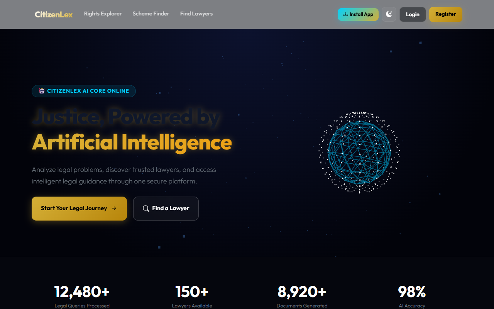

### 🔐 Login & Register
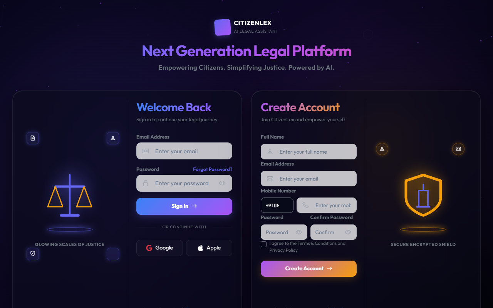

### 📊 Dashboard
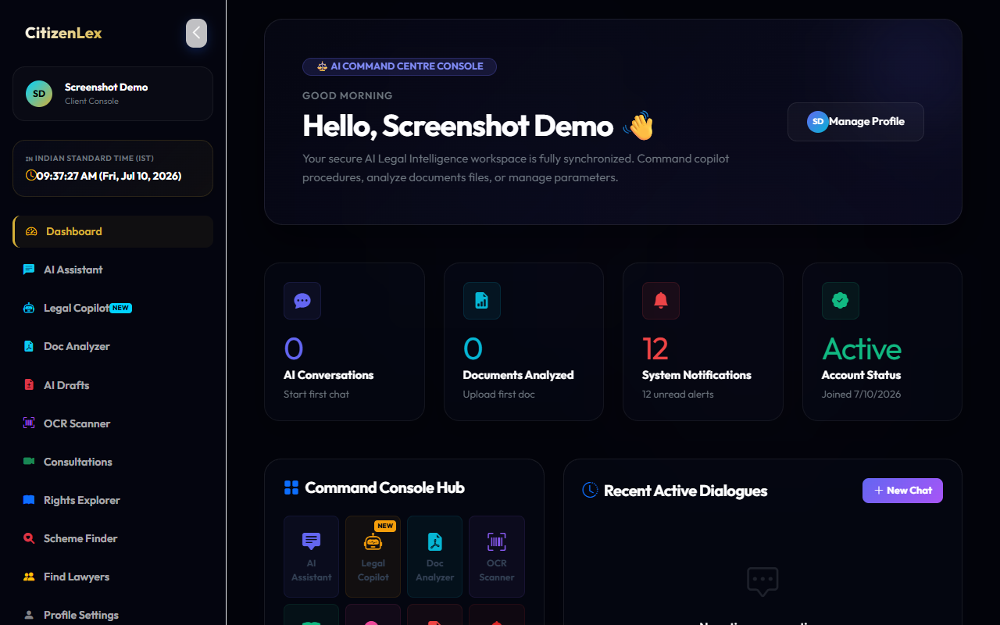

### 🤖 AI Legal Assistant
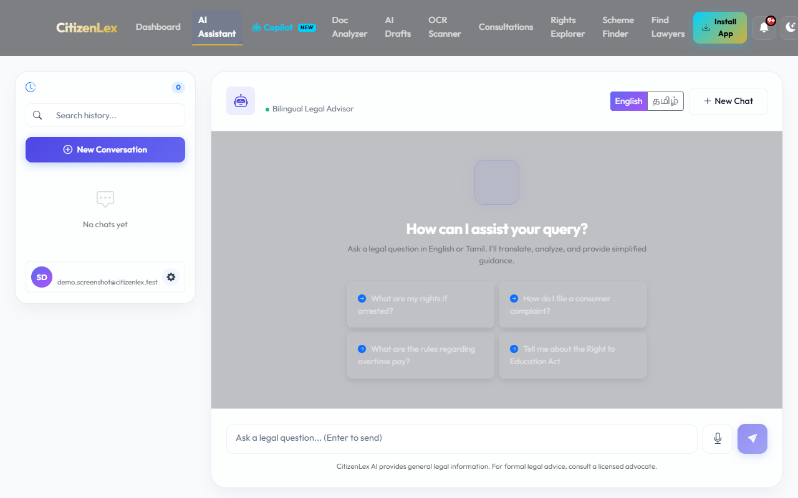

### ⚖️ AI Legal Copilot
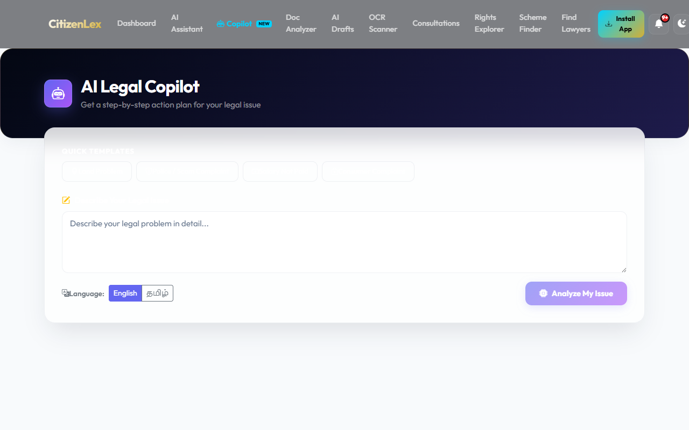

### 📚 Rights Explorer
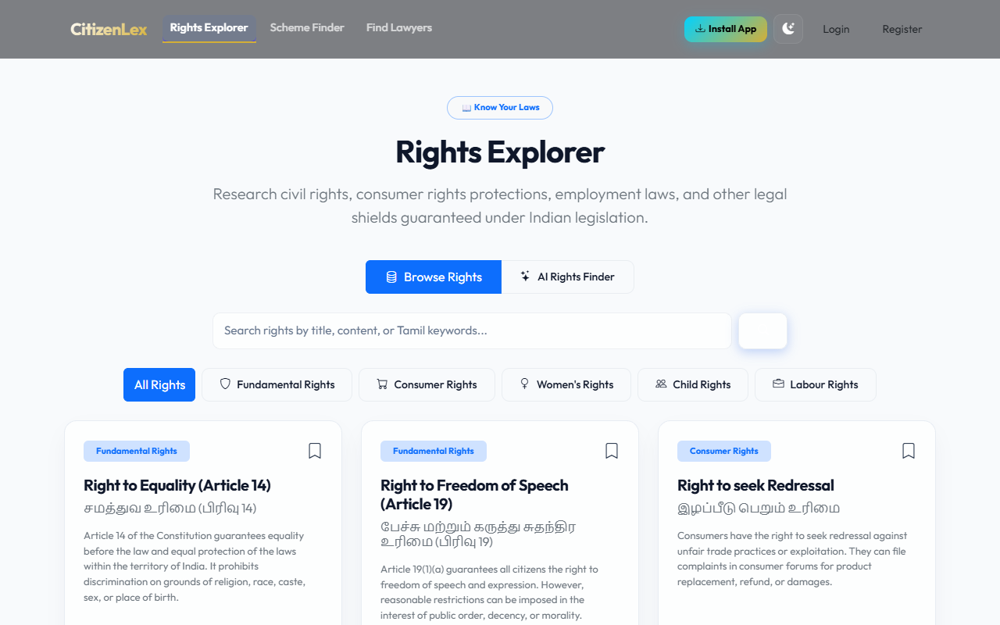

### 🏛️ Government Scheme Finder
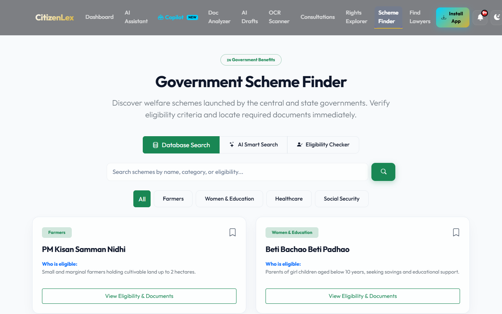

### 👨‍⚖️ Lawyer Marketplace
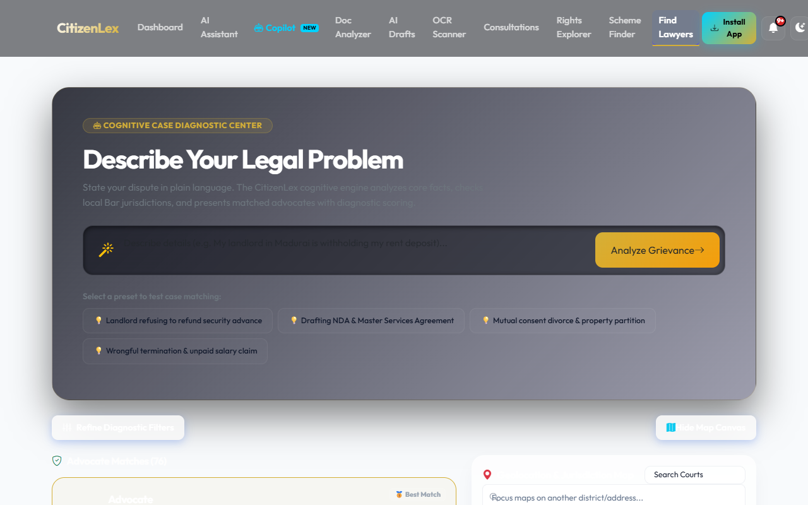

### 👤 Profile
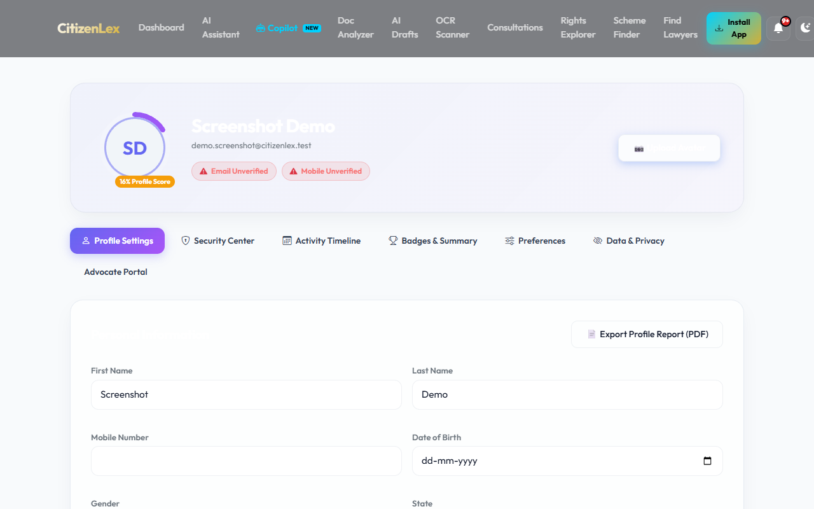

### 🔍 OCR Document Scanner
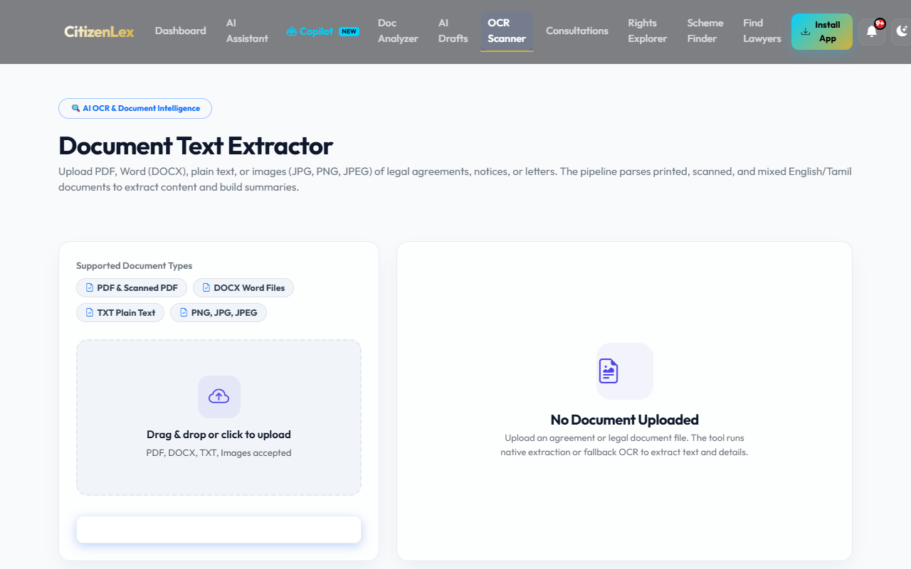

### 📝 AI Legal Draft Generator
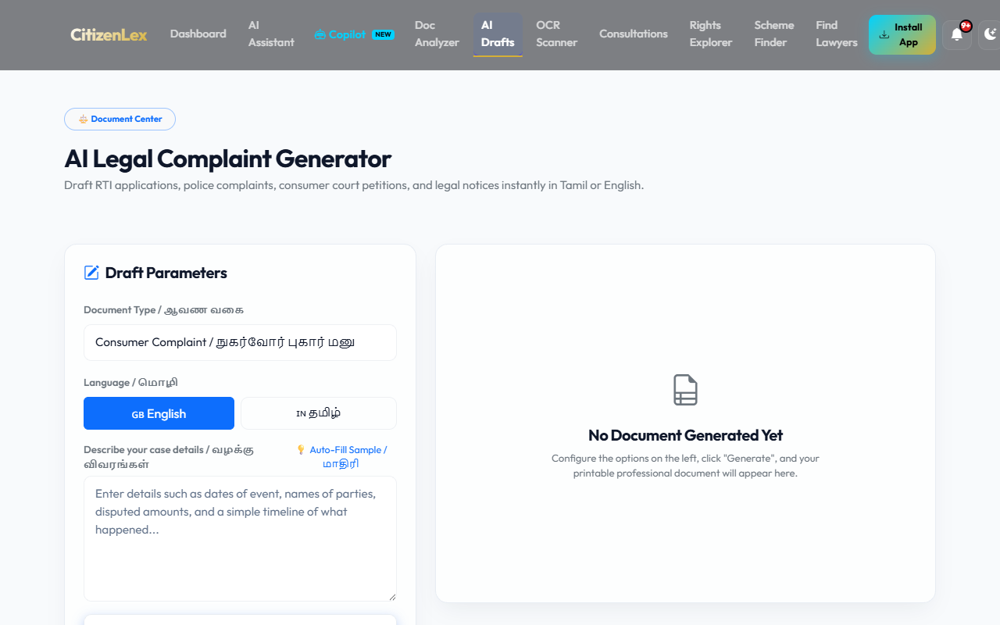

### 🔔 Notifications
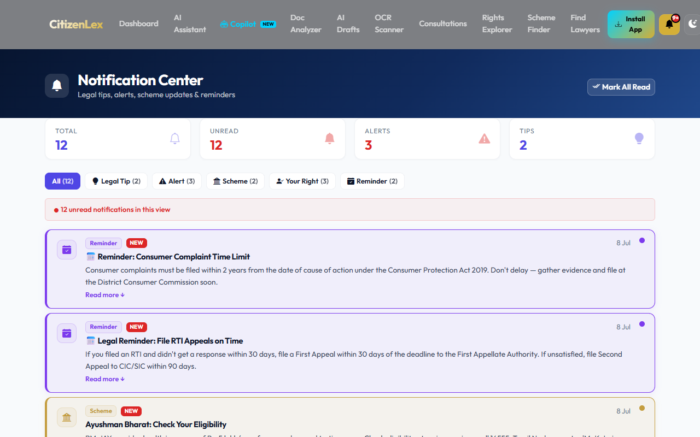

---

## 📁 Project Structure

```
AI-Powered-CitizenLex/
├── backend/                          # Spring Boot Backend
│   ├── src/main/java/com/citizenlex/
│   │   ├── controllers/              # REST API Controllers
│   │   ├── services/                 # Business Logic Layer
│   │   ├── models/                   # JPA Entity Classes
│   │   ├── repositories/             # Spring Data JPA Repositories
│   │   ├── security/                 # JWT + Spring Security Config
│   │   └── config/                   # App Configuration
│   ├── src/main/resources/
│   │   └── application.yml           # Application Configuration
│   └── pom.xml                       # Maven Dependencies
│
├── frontend/                         # React + Vite Frontend
│   ├── src/
│   │   ├── components/               # Reusable UI Components
│   │   ├── pages/                    # Route-Level Page Components
│   │   ├── context/                  # Auth, PWA & Theme Contexts
│   │   └── hooks/                    # Custom React Hooks
│   ├── public/                       # PWA Icons & Static Assets
│   ├── index.html                    # Entry HTML (PWA prompt setup)
│   └── vite.config.js                # Vite + PWA Configuration
│
├── docs/
│   ├── screenshots/                  # Application Screenshots (13 pages)
│   └── DEPLOYMENT.md                 # Production Deployment Guide
│
├── .github/workflows/
│   ├── java-ci.yml                   # Java CI/CD Pipeline
│   └── codeql.yml                    # CodeQL Security Scanning
│
├── vercel.json                       # Vercel Rewrite Rules
└── README.md                         # This File
```

---

## 🔐 Security Features

| Feature | Implementation |
|---|---|
| **JWT Authentication** | Stateless token-based auth with configurable expiry |
| **Password Encryption** | BCrypt hashing (Spring Security's PasswordEncoder) |
| **Spring Security** | Method-level security, CORS config, custom filter chain |
| **Secure REST APIs** | All protected endpoints require valid Bearer token |
| **Role-Based Access Control** | `USER` and `ADMIN` roles with scoped access permissions |
| **CodeQL Analysis** | Automated static security analysis on every push via GitHub Actions |

---

## 🚀 Deployment

| Service | Platform | URL |
|---|---|---|
| **Frontend** | Vercel | https://ai-powered-citizen-lex.vercel.app |
| **Backend** | Railway | https://ai-powered-citizenlex-production.up.railway.app |
| **Database** | Railway MySQL | Managed MySQL 8 on Railway |
| **Media Storage** | Cloudinary | Profile photos and generated documents |

Every push to `main` triggers the full pipeline automatically:

```
git push origin main
    ├── GitHub Actions CI  (build + test + CodeQL)
    ├── Railway            (backend auto-redeploy)
    └── Vercel             (frontend auto-redeploy)
```

---

## 🔮 Future Enhancements

1. 🌐 **Multilingual Support** — Full interface in Hindi, Tamil, Telugu, and other regional languages
2. 📱 **Native Mobile App** — React Native iOS & Android application
3. 🗣️ **Voice Interaction** — Voice-based legal queries using the Web Speech API
4. 🏛️ **Case Tracker** — Track ongoing legal cases with timeline visualization
5. 📜 **Legal Library** — Curated database of Indian Acts, sections, and landmark judgments
6. 🤝 **Lawyer Video Consultation** — In-app Jitsi video calls with verified advocates
7. 🔔 **Push Notifications** — FCM-powered push alerts for appointments and case updates
8. 📊 **Admin Analytics Dashboard** — Platform-wide usage analytics and reporting
9. 💳 **Subscription Plans** — Tiered access with Razorpay recurring billing
10. 🔗 **Government API Integration** — Direct connection to DigiLocker and e-Courts APIs

---

## 👨‍💻 Developer

| | |
|---|---|
| **Name** | Abishek K |
| **Registration Number** | 922524243004 |
| **GitHub** | [github.com/Abishekvsb](https://github.com/Abishekvsb) |
| **Project Repo** | [Ai-powered-CitizenLex](https://github.com/Abishekvsb/Ai-powered-CitizenLex) |
| **LinkedIn** | *Link to be added* |

---

## 📄 License

This project is licensed under the **[MIT License](LICENSE)** — see the [LICENSE](LICENSE) file for details.

[](https://opensource.org/licenses/MIT)

> Copyright © 2026 Abishek K (Abishek V S B). All rights reserved.

---

<div align="center">


<sub>💡 "The intersection of technology and justice is where I build."</sub>

</div>
