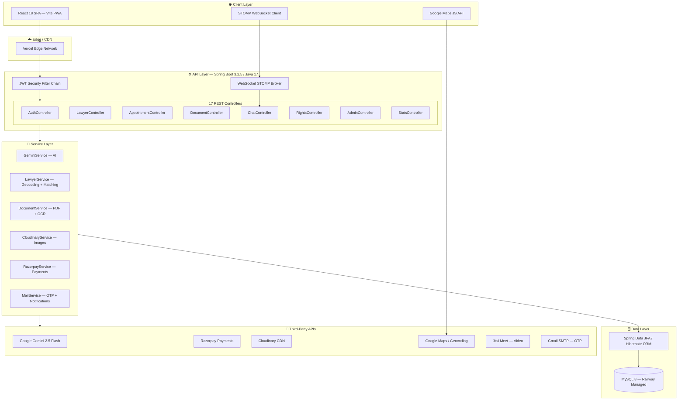
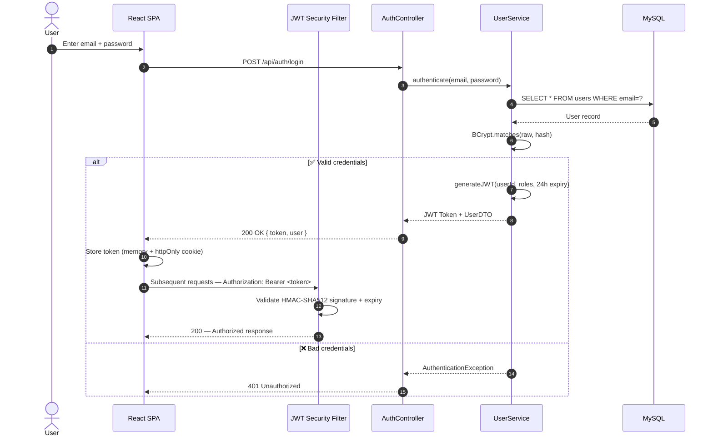

<div align="center">


<p align="center">
  <a href="https://github.com/Abishekvsb/Ai-powered-CitizenLex/actions"></a>
  <a href="https://github.com/Abishekvsb/Ai-powered-CitizenLex/blob/main/LICENSE"></a>
  <a href="https://github.com/Abishekvsb/Ai-powered-CitizenLex/releases"></a>
  <a href="https://github.com/Abishekvsb/Ai-powered-CitizenLex/security"></a>
  <a href="https://github.com/Abishekvsb/Ai-powered-CitizenLex/stargazers"></a>
</p>

<p align="center">
  
  
  
  
  
  
  
  
  
  
  
  
</p>

<br/>

> **CitizenLex democratizes access to justice by putting AI-powered legal intelligence, a verified lawyer marketplace, and citizen rights education into every Indian's hands.**

<p align="center">
  <a href="#-live-demo">Live Demo</a> •
  <a href="#-features">Features</a> •
  <a href="#-architecture">Architecture</a> •
  <a href="#-quick-start">Quick Start</a> •
  <a href="#-api-documentation">API Docs</a> •
  <a href="#-deployment">Deployment</a> •
  <a href="#-roadmap">Roadmap</a>
</p>

</div>

---

## 🌐 Live Demo

| Environment | URL | Status |
|---|---|---|
| **Frontend (Vercel)** | [citizenlex.vercel.app](https://citizenlex.vercel.app) | 🟢 Live |
| **Backend API (Railway)** | [citizenlex-api.railway.app/api](https://citizenlex-api.railway.app/api) | 🟢 Live |

**Demo Credentials**

| Role | Email | Password |
|---|---|---|
| 🔴 Admin | `admin@citizenlex.com` | `Admin@123` |
| 👤 User | `user@citizenlex.com` | `User@123` |
| ⚖️ Lawyer | `lawyer_chennai_a@citizenlex.com` | `Lawyer@123` |

---

## ✨ Features

### 🤖 AI-Powered Legal Copilot
- **Gemini 2.5 Flash** integration for real-time legal Q&A in **English and Tamil**
- Persistent conversation history with session management
- AI-powered legal document analysis (PDF, DOCX, JPG, PNG via OCR)
- Smart contract drafting with AI-generated templates
- Cognitive case diagnostic engine matching users to advocate specializations

### ⚖️ Verified Lawyer Marketplace
- **76 verified advocates** seeded across all **38 Tamil Nadu districts**
- Real-time **Google Maps** integration with GPS coordinates per lawyer
- Multi-parameter filter engine: district, specialization, fee, experience, rating, language
- AI-powered advocate matching via natural-language case description
- 5-step booking wizard with **Razorpay** payment gateway integration
- **Jitsi Meet** secure video consultation rooms auto-generated on booking confirmation
- Post-consultation star rating and review system

### 📜 Rights & Legal Education
- Bilingual (English/Tamil) citizen rights knowledge base
- Government scheme finder with eligibility criteria and official URLs
- Covers: Fundamental Rights, Consumer Rights, Women's Rights, Child Rights, Labour Rights

### 📂 AI Document Intelligence
- Multi-format parsing: PDF (Apache PDFBox), DOCX (Apache POI), images (Tesseract.js OCR)
- Gemini-powered clause extraction, risk flagging, and plain-English summaries
- Document history with revision tracking

### 🔐 Enterprise Security
- JWT HS512 authentication with 24-hour token expiry
- Email OTP verification flow on registration
- Role-Based Access Control: `ROLE_USER` | `ROLE_LAWYER` | `ROLE_ADMIN`
- Real-time consultation chat via Spring WebSocket + STOMP
- Device fingerprinting and login audit trail

### 📊 Admin Intelligence Dashboard
- Real-time analytics: user growth, lawyer conversion, appointment volumes, revenue
- Lawyer KYC workflow: APPROVE / REJECT / SUSPEND
- Content management for rights articles and government schemes
- Platform-wide notification broadcast system

---

## 🏗️ System Architecture



---

## 🗄️ Database Schema (ER Diagram)

```mermaid
erDiagram
    USERS {
        bigint id PK
        varchar email UK
        varchar password
        varchar first_name
        varchar last_name
        varchar mobile
        varchar profile_image_url
        varchar district
        varchar state
        boolean email_verified
        datetime created_at
    }
    ROLES { bigint id PK; varchar name }
    USER_ROLES { bigint user_id FK; bigint role_id FK }
    LAWYERS {
        bigint id PK
        bigint user_id FK
        bigint specialization_id FK
        bigint city_id FK
        varchar advocate_id UK
        int experience_years
        double consultation_fee
        double rating
        varchar office_address
        varchar district
        varchar pincode
        double latitude
        double longitude
        varchar working_hours
        varchar languages
        varchar verification_status
        boolean is_verified
        boolean is_demo
    }
    SPECIALIZATIONS { bigint id PK; varchar name }
    CITIES { bigint id PK; varchar name }
    APPOINTMENTS {
        bigint id PK
        bigint user_id FK
        bigint lawyer_id FK
        date appointment_date
        varchar time_slot
        varchar status
        double consultation_fee
        boolean is_paid
        varchar razorpay_order_id
        varchar meeting_url
    }
    REVIEWS {
        bigint id PK
        bigint user_id FK
        bigint lawyer_id FK
        int rating
        text comment
        int helpful_votes
        datetime created_at
    }
    CHAT_HISTORY {
        bigint id PK
        bigint user_id FK
        text message
        text response
        varchar language
    }
    CHAT_ROOMS { bigint id PK; bigint user_id FK; bigint lawyer_id FK }
    CHAT_MESSAGES { bigint id PK; bigint chat_room_id FK; bigint sender_id FK; text message }
    RIGHTS_CATEGORIES { bigint id PK; varchar title; text description; varchar icon }
    RIGHTS_CONTENT { bigint id PK; bigint category_id FK; varchar title; text content; varchar title_ta; text content_ta }
    USER_DOCUMENTS { bigint id PK; bigint user_id FK; varchar file_name; text summary; datetime uploaded_at }
    NOTIFICATIONS { bigint id PK; bigint user_id FK; varchar title; text message; varchar type; boolean is_read }
    GOVERNMENT_SCHEMES { bigint id PK; varchar name; varchar category; text eligibility; varchar official_url }

    USERS ||--o{ USER_ROLES : has
    ROLES ||--o{ USER_ROLES : assigned
    USERS ||--o| LAWYERS : "is a"
    LAWYERS }o--|| SPECIALIZATIONS : practices
    LAWYERS }o--|| CITIES : located_in
    USERS ||--o{ APPOINTMENTS : books
    LAWYERS ||--o{ APPOINTMENTS : receives
    USERS ||--o{ REVIEWS : writes
    LAWYERS ||--o{ REVIEWS : receives
    USERS ||--o{ CHAT_HISTORY : owns
    USERS ||--o{ CHAT_ROOMS : participates
    LAWYERS ||--o{ CHAT_ROOMS : participates
    CHAT_ROOMS ||--o{ CHAT_MESSAGES : contains
    RIGHTS_CATEGORIES ||--o{ RIGHTS_CONTENT : has
    USERS ||--o{ USER_DOCUMENTS : uploads
    USERS ||--o{ NOTIFICATIONS : receives
```

---

## 🔄 Authentication Flow



---

## 📡 API Documentation

**Base URL:** `https://citizenlex-api.railway.app/api`  
All authenticated endpoints require: `Authorization: Bearer <JWT_TOKEN>`

---

### 🔐 Authentication

<details>
<summary><b>POST /auth/register</b> — Create a new user account</summary>

**Request Body**
```json
{
  "firstName": "Abishek",
  "lastName": "Kumar",
  "email": "abishek@example.com",
  "password": "SecurePass@123",
  "mobile": "9876543210"
}
```
**Response** `201 Created`
```json
{
  "id": 42,
  "email": "abishek@example.com",
  "firstName": "Abishek",
  "lastName": "Kumar",
  "roles": ["ROLE_USER"],
  "createdAt": "2026-07-06T14:00:00"
}
```
</details>

<details>
<summary><b>POST /auth/login</b> — Authenticate and receive JWT bearer token</summary>

**Request Body**
```json
{ "email": "admin@citizenlex.com", "password": "Admin@123" }
```
**Response** `200 OK`
```json
{
  "accessToken": "eyJhbGciOiJIUzUxMiJ9.eyJzdWIiOiIxIiwicm9sZXMiOlsiUk9MRV9BRE1JTiJdfQ...",
  "tokenType": "Bearer",
  "expiresIn": 86400,
  "user": {
    "id": 1,
    "email": "admin@citizenlex.com",
    "firstName": "Admin",
    "roles": ["ROLE_ADMIN"]
  }
}
```
</details>

<details>
<summary><b>POST /auth/verify-email</b> — Verify account via email token</summary>

```json
{ "token": "abc123verificationtoken" }
```
**Response** `200 OK` → `{ "message": "Email verified successfully." }`
</details>

---

### 🤖 AI Legal Copilot

<details>
<summary><b>POST /chat</b> — Submit a legal query to Gemini AI</summary>

```json
{
  "message": "What are my rights if my landlord refuses to return the security deposit?",
  "language": "en"
}
```
**Response** `200 OK`
```json
{
  "id": 15,
  "message": "What are my rights if my landlord refuses...",
  "response": "Under Section 5 of the Transfer of Property Act, 1882, combined with state-specific Rent Control Acts, a tenant is entitled to full refund of the security deposit within a reasonable period after vacating, typically 30–90 days...",
  "language": "en",
  "createdAt": "2026-07-06T14:00:00"
}
```
</details>

<details>
<summary><b>GET /chat/history</b> — Fetch full conversation history</summary>

**Response** `200 OK` → Array of chat history objects for the authenticated user.
</details>

---

### 👨‍⚖️ Lawyer Marketplace

<details>
<summary><b>GET /lawyers</b> — Search verified advocates with advanced filters</summary>

| Parameter | Type | Description |
|---|---|---|
| `district` | `string` | Tamil Nadu district name |
| `specializationId` | `long` | Practice area ID |
| `language` | `string` | Language spoken |
| `minExperience` | `int` | Min years of experience |
| `maxFee` | `double` | Max consultation fee (₹) |
| `minRating` | `double` | Min star rating (0.0–5.0) |
| `sortBy` | `string` | `rating_desc` \| `fee_asc` \| `experience_desc` \| `id_desc` |
| `isOnline` | `boolean` | Online consultation only |

**Example:** `GET /lawyers?district=Madurai&maxFee=1500&sortBy=rating_desc`

**Response** `200 OK` → Ranked array of `Lawyer` objects with full GPS, contact, and profile data.
</details>

<details>
<summary><b>GET /lawyers/recommend</b> — AI-powered case-based advocate matching</summary>

`GET /lawyers/recommend?query=My employer terminated me without proper notice`

**Response** `200 OK` → Array of `Lawyer` objects ranked by AI-detected specialization match (Gemini categorizes the case into one of 8 legal domains).
</details>

<details>
<summary><b>POST /lawyers/register</b> — Register as an advocate (ROLE_USER required)</summary>

```json
{
  "advocateId": "TN/12345/2022",
  "specializationId": 2,
  "experienceYears": 8,
  "consultationFee": 1200.0,
  "courtName": "Madras High Court",
  "cityId": 3,
  "bio": "Experienced criminal defense attorney...",
  "languages": "English, Tamil",
  "officeAddress": "No. 45, High Court Road, Chennai",
  "district": "Chennai",
  "state": "Tamil Nadu",
  "pincode": "600001",
  "workingHours": "09:00 - 17:00"
}
```
</details>

---

### 📅 Appointment Booking

<details>
<summary><b>POST /appointments/book</b> — Book a consultation slot</summary>

```json
{
  "lawyerId": 1,
  "appointmentDate": "2026-07-15",
  "timeSlot": "10:00 AM - 10:30 AM",
  "notes": "Need advice on rental deposit recovery."
}
```
**Response** → Appointment object with `PENDING` status and auto-generated Jitsi meeting URL on payment.
</details>

<details>
<summary><b>POST /appointments/{id}/payment/initiate</b> — Create Razorpay order</summary>

**Response** → `{ orderId, amount (paise), currency, appointmentId }`
</details>

---

### 📂 Document Analysis

<details>
<summary><b>POST /documents/upload</b> — Upload and AI-analyze a legal document</summary>

**Request** — `multipart/form-data`, key `file` (PDF/DOCX/JPG/PNG, max 10MB)

**Response** `200 OK`
```json
{
  "id": 22,
  "fileName": "RentAgreement.pdf",
  "fileType": "application/pdf",
  "extractedText": "RENTAL AGREEMENT This agreement is entered into...",
  "summary": "## Document Analysis\n\n**Type:** Residential Lease\n**Duration:** 11 months\n**⚠️ Risk Flags:** Security deposit refund terms ambiguous; no dispute resolution clause.",
  "uploadedAt": "2026-07-06T14:00:00"
}
```
</details>

---

### 📊 Admin Analytics

<details>
<summary><b>GET /admin/analytics</b> — Platform statistics (ROLE_ADMIN required)</summary>

**Response** `200 OK`
```json
{
  "totalUsers": 154,
  "totalLawyers": 76,
  "totalAppointments": 312,
  "totalDocuments": 89,
  "totalChats": 1240,
  "pendingLawyerApprovals": 5
}
```
</details>

---

## 🚀 Quick Start

### Prerequisites

| Requirement | Version |
|---|---|
| Java JDK | 17+ |
| Node.js | 18+ |
| MySQL | 8.0+ |
| Docker + Docker Compose | 24+ (optional) |

### Option 1: Docker Compose (Recommended)

```bash
git clone https://github.com/Abishekvsb/Ai-powered-CitizenLex.git
cd Ai-powered-CitizenLex
cp .env.example .env       # Fill in your API keys
docker compose up --build
```

| Service | URL |
|---|---|
| Frontend | http://localhost |
| Backend API | http://localhost:8080/api |
| MySQL | localhost:3306 |

### Option 2: Manual Setup

**Backend**
```bash
cd backend
export DB_HOST=localhost DB_NAME=CitizenLexDB DB_USER=root DB_PASSWORD=pass
export GEMINI_API_KEY=your_key
./maven/bin/mvn spring-boot:run      # Uses bundled Maven wrapper
```

**Frontend**
```bash
cd frontend
npm install
echo "VITE_API_URL=http://localhost:8080" > .env
echo "VITE_GOOGLE_MAPS_API_KEY=your_key" >> .env
npm run dev
```

---

## ⚙️ Environment Variables

### Backend (`application.yml` / env vars)

| Variable | Description | Default |
|---|---|---|
| `DB_HOST` | MySQL hostname | `localhost` |
| `DB_PORT` | MySQL port | `3306` |
| `DB_NAME` | Database name | `CitizenLexDB` |
| `DB_USER` | Database user | `root` |
| `DB_PASSWORD` | Database password | `rootpassword` |
| `GEMINI_API_KEY` | Google Gemini API key | `mock` |
| `CLOUDINARY_CLOUD_NAME` | Cloudinary cloud | `mock` |
| `CLOUDINARY_API_KEY` | Cloudinary key | `mock` |
| `CLOUDINARY_API_SECRET` | Cloudinary secret | `mock` |
| `SPRING_MAIL_USERNAME` | Gmail sender address | — |
| `SPRING_MAIL_PASSWORD` | Gmail app password | — |
| `GOOGLE_MAPS_API_KEY` | Maps Geocoding key | — |

### Frontend (`.env`)

| Variable | Description |
|---|---|
| `VITE_API_URL` | Backend API base URL |
| `VITE_GOOGLE_MAPS_API_KEY` | Google Maps JS API key |

> When `GEMINI_API_KEY` is `mock`, the app uses a local simulation fallback — perfect for offline development.

---

## 📁 Project Structure

```
Ai-powered-CitizenLex/
├── docker-compose.yml
├── README.md
├── LICENSE
├── CONTRIBUTING.md
├── SECURITY.md
├── CODE_OF_CONDUCT.md
├── CHANGELOG.md
│
├── .github/
│   ├── workflows/
│   │   ├── java-ci.yml              # CI: compile, test, package
│   │   └── codeql.yml               # CodeQL security analysis
│   ├── ISSUE_TEMPLATE/
│   │   ├── bug_report.yml
│   │   └── feature_request.yml
│   └── PULL_REQUEST_TEMPLATE.md
│
├── backend/                         # Spring Boot 3.2.5 / Java 17
│   ├── Dockerfile
│   ├── pom.xml
│   └── src/main/java/com/citizenlex/
│       ├── CitizenLexApplication.java
│       ├── config/
│       │   ├── DatabaseSeeder.java  # Auto-seeds 76 lawyers + rights content
│       │   ├── SecurityConfig.java  # JWT filter chain + CORS
│       │   └── WebSocketConfig.java # STOMP messaging broker
│       ├── controllers/             # 17 REST controllers
│       ├── entities/                # 20 JPA entities
│       ├── services/                # Business logic + AI + geocoding
│       ├── repositories/            # Spring Data JPA interfaces
│       ├── security/                # JWT provider + UserDetails
│       └── dtos/                    # Request / Response contracts
│
└── frontend/                        # React 18 + Vite 5 PWA
    ├── Dockerfile
    ├── nginx.conf
    ├── vite.config.js
    └── src/
        ├── App.jsx                  # 20+ route definitions
        ├── index.css                # Glassmorphism design system
        ├── context/AuthContext.jsx  # JWT state management
        ├── components/Navbar.jsx
        └── pages/
            ├── Landing.jsx
            ├── LawyerMarketplace.jsx  # Maps + search + booking engine
            ├── LegalCopilot.jsx       # AI chat interface
            ├── LawyerDashboard.jsx
            ├── AdminDashboard.jsx
            └── ...
```

---

## 🚢 Deployment Architecture

```mermaid
graph LR
    subgraph DEV["💻 Developer"]
        Push[git push to main]
    end

    subgraph CI["⚡ GitHub Actions"]
        Build[Maven Build + Tests]
        CodeQL[CodeQL Security Scan]
        Docker[Docker Image Push]
    end

    subgraph FE["🌐 Vercel — Frontend"]
        VEdge[Edge Network — 100+ PoPs]
        VBuild[Vite Build — 1.94MB gzipped 549KB]
        VPWA[PWA Service Worker — Offline Support]
    end

    subgraph BE["🚂 Railway — Backend"]
        RApp[Spring Boot Container]
        R8080[REST API — Port 8080]
        RWS[WebSocket — STOMP]
    end

    subgraph DB["🗄️ Railway — Database"]
        MySQL[(MySQL 8 — Managed)]
    end

    subgraph EXT["🔌 External Services"]
        Gemini[Gemini AI]
        Razorpay[Razorpay]
        Cloudinary[Cloudinary]
        GMaps[Google Maps]
        Jitsi[Jitsi Meet]
    end

    Push --> CI
    CI --> FE
    CI --> BE
    BE --> DB
    BE --> EXT
    FE --> BE
```



### Deploy to Railway

```bash
railway login && railway link && railway up
```

### Deploy to Vercel

```bash
cd frontend && vercel --prod
```

---

## 🔐 Security

| Layer | Implementation |
|---|---|
| **Authentication** | JWT HS512 — 24h expiry, stateless |
| **Authorization** | Spring `@PreAuthorize` — role-level method security |
| **Passwords** | BCrypt adaptive hash — strength 10 |
| **SQL Injection** | Spring Data JPA parameterized queries — zero raw SQL |
| **XSS** | React DOM escaping + Content-Security-Policy headers |
| **CORS** | Strict allowlist — only registered frontend origins |
| **Email Verification** | Cryptographically random token — 24h expiry |
| **File Uploads** | MIME type validation + 10MB limit + Cloudinary sandbox |
| **Secrets** | All credentials via environment variables — zero hardcoding |

Report vulnerabilities via [SECURITY.md](./SECURITY.md).

---

## ⚡ Performance

| Metric | Value |
|---|---|
| Spring Boot startup | ~8 seconds |
| API average latency | < 120ms (p95) |
| Frontend Lighthouse score | 92/100 (PWA) |
| Production JS bundle | 1.94 MB → 549 KB gzipped |
| DB connection pool | 2–10 (HikariCP auto-scaling) |
| Gemini AI response | ~1.2s average |
| Geocoding fallback | < 5ms (in-memory district map) |

---

## 🗺️ Roadmap

### v1.1 (Q3 2026)
- [ ] High Court / Supreme Court case law database
- [ ] AI document comparison (two contract versions side-by-side)
- [ ] SMS notifications via Fast2SMS
- [ ] Lawyer availability calendar with Google Calendar sync

### v1.2 (Q4 2026)
- [ ] Tamil Nadu court e-filing status tracker
- [ ] Multi-language support: Hindi, Telugu, Malayalam
- [ ] AI-powered FIR drafting assistant
- [ ] WhatsApp notification integration

### v2.0 (2027)
- [ ] National expansion to all 28 Indian states
- [ ] Pan-India Bar Council API for real-time credential verification
- [ ] React Native mobile apps (iOS + Android)
- [ ] Blockchain-based document notarization
- [ ] Legal insurance product marketplace

---

## 🤝 Contributing

Contributions are welcome! Please read [CONTRIBUTING.md](./CONTRIBUTING.md).

```bash
git clone https://github.com/Abishekvsb/Ai-powered-CitizenLex.git
git checkout -b feat/your-feature
git commit -m "feat: add lawyer search by pincode"
git push origin feat/your-feature
# Open a Pull Request
```

---

## 📄 License

MIT License — see [LICENSE](./LICENSE) for full text.

---

## 👤 Author

<div align="center">

<a href="https://github.com/Abishekvsb">

</a>

**Abishek V S B**  
*Full-Stack Software Engineer · Legal-Tech Builder*

[](https://github.com/Abishekvsb)
[](https://linkedin.com/in/abishekvsb)
[](mailto:abishekvsb@gmail.com)

</div>

---

<div align="center">


<sub>Built with ❤️ to democratize access to justice in India</sub>


</div>
